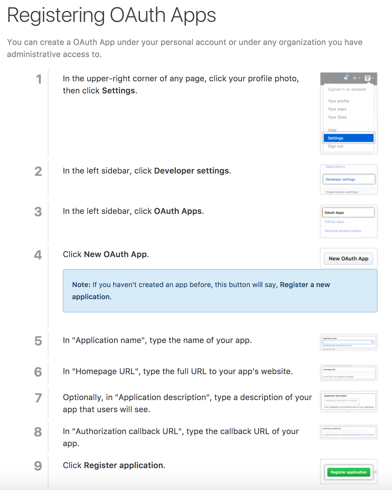

# gofabric8

fabric8 uses a CLI that makes installing fabric8 locally or on remote Kubernetes based clusters very easy.

gofabric8 also has lots of handy commands that makes it easier to work with fabric8 and OpenSHift / Kubernetes

Download the latest gofabric8 release from [GitHub](https://github.com/fabric8io/gofabric8/releases/latest/) or run this script:
```
curl -sS https://get.fabric8.io/download.txt | bash
```

add '~/.fabric8/bin' to your path so you can execute the new binaries, for example: edit your ~/.zshrc or ~/.bashrc and append to the end of the file

```
export PATH=$PATH:~/.fabric8/bin
source ~/.zshrc or ~/.bashrc
```

## Setup GitHub client ID and secret

We now have GitHub integration letting you browse repositories, create new repositories, edit projects and setup automated CI / CD jobs with webhooks on github.

This requires an [OAuth application to be setup on your github account](https://developer.github.com/apps/building-integrations/setting-up-and-registering-oauth-apps/registering-oauth-apps/) for fabric8 and you need to obtain the client ID and secret for the OAuth application.


You will need to register the redirect URI in the OAuth application to point to the output of this command:

```
echo http://keycloak-fabric8.$(minishift ip).nip.io/auth/realms/fabric8/broker/github/endpoint
```

So please follow the following steps using the above redirect URL and `http://fabric8.io` as a sample homepage URL:





Once you have created the OAuth application for fabric8 in your github settings and found your client ID and secret then type the following:

```
export GITHUB_OAUTH_CLIENT_ID=TODO
export GITHUB_OAUTH_CLIENT_SECRET=TODO
```

where the above `TODO` text is replaced by the actual client id and secret from your github settings page!


### Installing on MiniKube

The following are the instructions for installing fabric8 on minikube:

```
minikube start --vm-driver=xhyve --cpus=5 --disk-size=50g --memory=5000 --kubernetes-version v1.7.0
minikube addons enable ingress
gofabric8 deploy --package system -n fabric8
```

### Installing on MiniShift

The following are the instructions for installing fabric8 on minishift:

* Make sure you have a recent (3.5 of openshift or 1.5 of origin later) distribution of the `oc` binary on your `$PATH`
```
oc version
```
* If you have an old version or its not found please [download a distribution of the openshift-client-tools for your operating system](https://github.com/openshift/origin/releases/latest/) and copy the `oc` binary onto your `$PATH`

* [download the minishift distribution for your platform](https://github.com/minishift/minishift/releases) extract it and place the `minishift` binary on your `$PATH` somewhere
* start up minishift via something like this (on OS X):

```
minishift start --vm-driver=xhyve --memory=7000 --cpus=4 --disk-size=50g
```
or on any other operating system (feel free to add the `--vm-driver` parameter of your choosing):

```
minishift start --memory=7000 --cpus=4 --disk-size=50g
```
* now use gofabric8

```
gofabric8 deploy --package system -n fabric8
```

* if you want to install a specific version of the [fabric8 system template](http://central.maven.org/maven2/io/fabric8/platform/packages/fabric8-system/) then type the following:

```
export FABRIC8_VERSION=4.X.XXX
```
Or add the argument `local` to use a local build.

### Installing on remote public Kubernetes clusters
Get a connection to your cluster so that the following command works:
```
kubectl get nodes
```
Now deploy fabric8:
```
gofabric8 deploy --package system -n fabric8
```
By default we will use the magic domain `nip.io` when generating ingress rules when deployed as above.  If you provide your own domain string that you want fabric8 to use when generating ingress rules then we also deploy kube-lego which will automatically generate + refresh signed certificates for you.  To opt out of this simply pass the `--tls-acme=false` flag.

To have https signed certs generated automatically for your domain run this instead:
```
export TLS_ACME_EMAIL=email.address@for.certbot.com
gofabric8 deploy --package system --domain example.domain.fabirc8.io -n fabric8
```

### Installing on remote public OpenShift clusters

Installing on a remote public OpenShift clusters will be the same process as the Kubernetes install. You make sure you are logged in into the remote OpenShift cluster first before deploying :

```
oc login
```

And deploy as per the instructions for Kubernetes remote install.

If you have deployed with the [oc cluster up](https://github.com/openshift/origin/blob/master/docs/cluster_up_down.md) command you may run into some selinux issues and you have to run this command to change the context of the local volumes to allow to write to it :

```
chcon -Rt svirt_sandbox_file_t /var/lib/origin/openshift.local.volumes/
```

### Local development

If you are developing locally and want to deploy custom version of YAML then you can clone this repo and run:

```
mvn clean install  -DskipTests=true
```
MiniKube / Kubernetes
```
gofabric8 deploy --namespace fabric8 --legacy=false -y --package=packages/fabric8-system/target/classes/META-INF/fabric8/k8s-template.yml
```
MiniShift / OpenShift
```
gofabric8 deploy --namespace fabric8 --legacy=false -y --package=packages/fabric8-system/target/classes/META-INF/fabric8/openshift.yml
```

### Accept the insecure URLs in your browser - remote OpenShift clusters ONLY

Currently there are 4 different URLS that Chrome will barf on and you'll have to explcitily click on the `ADVANCED` button then click on the URL to tell your browser its fine to trust the URLs before you can open and use the new fabric8 console

The above script should list the 4 URLs you need to open separately and approve.

We hope to figure out a nicer alternative to this issue! The problem is things like lenscript only work for public hosted URLs; whereas running locally on MiniShift we're local but use `nip.io` to provide a global URL to your local machine (to simplify having to do DNS magic on your laptop). If you fancy trying to help fix this [please check out this MiniShift issue](https://github.com/minishift/minishift/issues/1031)
