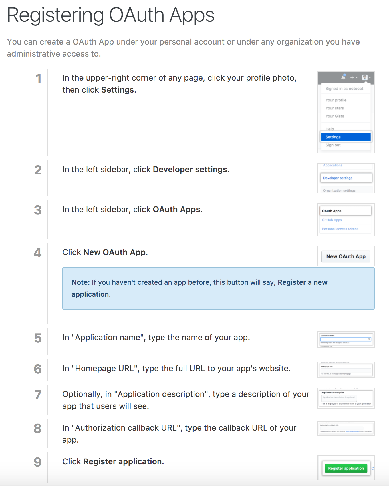
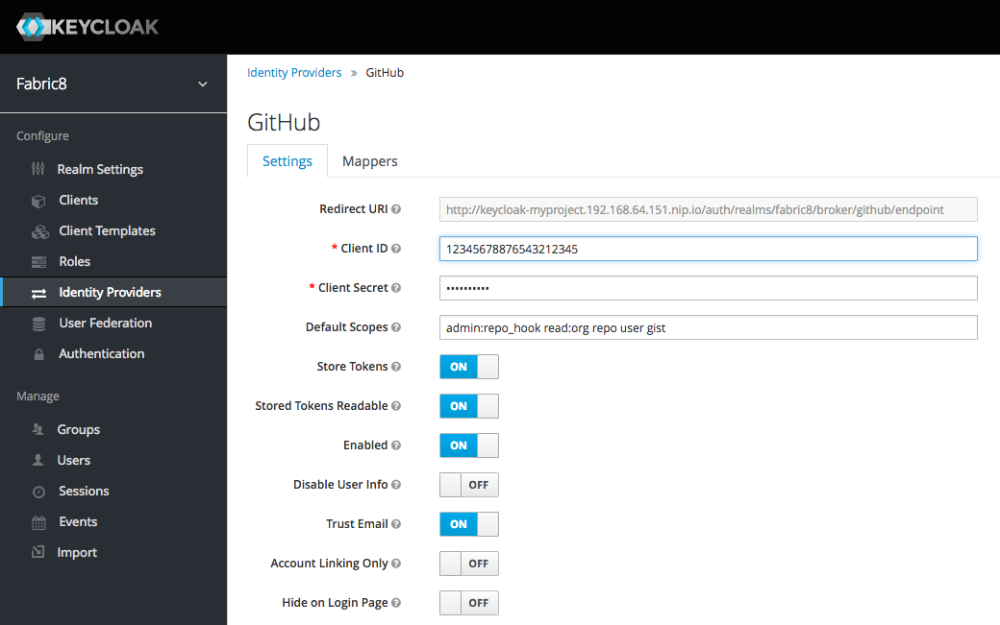

# Fabric8 Developer Platform

This project generates the distribution of the [fabric8 developer platform](https://fabric8.io/)

 <p align="center">
   <a href="http://fabric8.io/">
    
   </a>
 </p>


To install the early access of this on [Minishift check out the installation guide](INSTALL.md)

## Projects

The fabric8 developer platform is based on lots of different open source projects. Here's the main fabric8 repositories:

### [Maven Tooling](https://maven.fabric8.io/)

* [fabric8-maven-plugin](https://github.com/fabric8io/fabric8-maven-plugin) provides [Apache Maven](http://maven.apache.org/) support for Kubernetes, OpenShift and Fabric8

### [Developer Console](https://fabric8.io/guide/console.html)

* [fabric8-console](https://github.com/fabric8io/fabric8-console) the web console for fabric8
* [fabric8-forge](https://github.com/fabric8io/fabric8-forge) contains the main [JBoss Forge addons and REST service](https://fabric8.io/guide/forge.html) which provides developer wizards to create and edit projects

We are working on migrating the consoles to [Angular 2](https://angular.io/). All the Angular 2 based UI work is hosted in the [fabric8-ui github organisation](https://github.com/fabric8-ui/). 

Here are the Angular 2 versions of the consoles:

* [fabric8-runtime-console](https://github.com/fabric8-ui/fabric8-runtime-console) the Angular 2 based web console for fabric8


#### CI / CD 

* [fabric8-pipeline-library](https://github.com/fabric8io/fabric8-pipeline-library) provides a set of reusable [Jenkins Pipeline](https://jenkins.io/doc/book/pipeline/) steps and functions that you can reuse inside your `Jenkinsfile` via the [@Library annotation](https://github.com/fabric8io/fabric8-pipeline-library#how-to-use-this-library) 
* [fabric8-jenkinsfiles-library](https://github.com/fabric8io/fabric8-jenkinsfile-library) provides a set of reusable `Jenkinsfile` files you can use on your projects. The `Jenkisnfiles` resue the [fabric8-pipeline-library](https://github.com/fabric8io/fabric8-pipeline-library and they are used by the [Developer Console](https://fabric8.io/guide/console.html) when creating projects or choosing pipelines.
* [kubernetes-plugin](https://github.com/jenkinsci/kubernetes-plugin) is the Jenkins plugin which adds native Kubernetes support for defining build slave pods with custom pods, images, volumes and secrets. Its reused by the [fabric8-jenkinsfiles-library](https://github.com/fabric8io/fabric8-jenkinsfile-library)
* [fabric8-jenkins-workflow-steps](https://github.com/fabric8io/fabric8-jenkins-workflow-steps) the Jenkins Pipeline steps for working with [Microservices Platform](https://fabric8.io/guide/fabric8DevOps.html)

### [DevOps](https://fabric8.io/guide/fabric8DevOps.html)

* [fabric8-devops](https://github.com/fabric8io/fabric8-devops) contains the main [DevOps microservices for the Developer Platform](https://fabric8.io/guide/fabric8DevOps.html)

### [iPaaS](https://fabric8.io/guide/ipaas.html)

* [fabric8-ipaas](https://github.com/fabric8io/fabric8-ipaas) contains the main [iPaaS](https://fabric8.io/guide/ipaas.html) applications
* [ipaas-quickstarts](https://github.com/fabric8io/ipaas-quickstarts) contains the [quickstarts](https://fabric8.io/guide/quickstarts/index.html) and [archetypes](https://fabric8.io/guide/quickstarts/archetypes.html) for the [iPaaS](https://fabric8.io/guide/ipaas.html)


### [kubeflix](https://github.com/fabric8io/kubeflix)

* [kubeflix](https://github.com/fabric8io/kubeflix) provides <a href="http://kubernetes.io/">Kubernetes</a> integration with <a href="https://netflix.github.io/">Netflix OSS</a> like <a href="https://github.com/Netflix/Hystrix">Hystrix</a>, <a href="https://github.com/Netflix/Ribbon">Ribbon</a> and <a href="https://github.com/Netflix/Turbine">Turbine</a>

### Tools

* [gofabric8](https://github.com/fabric8io/gofabric8) is a go based CLI tool for installing and managing fabric8


### Suppport for non-docker

Some folks have work loads they need to orchestrate on operating systems that don't yet have production quality docker support (e.g. Windows, AIX, Solaris, HPUX).

* [kansible](https://github.com/fabric8io/kansible) lets you orchestrate operating system processes on Windows or any Unix in the same way as you orchestrate your Docker containers with Kubernetes by using Ansible to provision the software onto hosts and Kubernetes to orchestrate the processes and the containers in a single system


## Java Libraries

If you want to write any Java/JVM based tools to interact with [Kubernetes](http://kubernetes.io) we have a number of libraries to help:

### Kubernetes

Kubernetes provides the main REST API for working with the [Kubernetes Platform](http://kubernetes.io). It should provide all you need for writing most services and plugins for Kubernetes.

* [kubernetes-model](https://github.com/fabric8io/kubernetes-model) the Java DTOs for working with [kubernetes](http://kubernetes.io/) and OpenShift which are generated from the go source code in kubernetes and OpenShift
* [kubernetes-client](https://github.com/fabric8io/fubernetes-client) provides a Java API for working with the Kubernetes and OpenShift REST API (pods, replication controllers, services etc)

* [fabric8](https://github.com/fabric8io/fabric8) contains the main java libraries such as:
* [kubernetes-api](https://github.com/fabric8io/fabric8/tree/master/components/kubernetes-api) provides helper APIs around the [kubernetes-client](https://github.com/fabric8io/fubernetes-client) for working with Kubernetes and OpenShift
* [kubernetes-jolokia](https://github.com/fabric8io/fabric8/tree/master/components/kubernetes-jolokia) makes it easy to work with the [Jolokia Client API](http://jolokia.org/reference/html/clients.html#client-java) and Java containers running in [Pods](pods.html) inside Kubernetes which expose the Jolokia port

#### Testing

* [fabric8-arquillian](https://github.com/fabric8io/fabric8/tree/master/components/fabric8-arquillian) provides a plugin for [Arquillian](fabric8-arquillian) for integration testing [Apps](apps.html) on top of Kubernetes; using Kubernetes to provision and orchestrate the containers and then making [assertions](https://github.com/fabric8io/fabric8/tree/master/components/kubernetes-assertions) that the required resources startup correctly.
* [fabric8-selenium](https://github.com/fabric8io/fabric8/tree/master/components/fabric8-selenium) provides a library to make it easier to create [Selenium WebDriver based](http://www.seleniumhq.org/projects/webdriver/) integration and system tests on Kubernetes using [fabric8-arquillian](https://github.com/fabric8io/fabric8/tree/master/components/fabric8-arquillian)
* [kubernetes-assertions](https://github.com/fabric8io/fabric8/tree/master/components/kubernetes-assertions) provides a set of [assertj](http://joel-costigliola.github.io/assertj/) assertions of the form **assertThat(kubernetesResource)** for working with the [kubernetes-api](https://github.com/fabric8io/fabric8/tree/master/components/kubernetes-api)
* [jolokia-assertions](https://github.com/fabric8io/fabric8/tree/master/components/jolokia-assertions) makes it easy to perform assertions on remote JVMs via JMX using  [Jolokia](http://jolokia.org/) over HTTP/JSON


#### Spring

* [spring-cloud-kubernetes](https://github.com/fabric8io/spring-cloud-kubernetes) provides <a href="http://kubernetes.io/">Kubernetes</a> integration with <a href="http://projects.spring.io/spring-cloud/">Spring Cloud</a>
* [kubernetes-zipkin](https://github.com/fabric8io/kubernetes-zipkin) provides <a href="http://kubernetes.io/">Kubernetes</a> integration with <a href="http://zipkin.io/">Zipkin</a> for tracing microservices


### ActiveMQ

* [mq-client](https://github.com/fabric8io/fabric8-ipaas/tree/master/mq-client) provides the the **io.fabric8.mq.core.MQConnectionFactory** class which implements the JMS ConnectionFactory to connect to Apache ActiveMQ Artemis using the [Kubernetes Service](http://fabric8.io/guide/services.html) discovery mechanism which requires no user configuration (other than a single environment variable if you wish to switch to a non default service implementation)


### Camel 

* [camel-amq](https://github.com/fabric8io/fabric8-ipaas/tree/master/camel-amq) provides the [Camel](http://camel.apache.org/) **amq:** component which uses the [Kubernetes Service](http://fabric8.io/guide/services.html) discovery mechanism to discover and connect to the ActiveMQ Artemis brokers so that no configuration is required (other than a single environment variable if you wish to switch to a non default service implementation)

* [camel-master](https://github.com/fabric8io/fabric8-ipaas/tree/master/camel-master) provides the [Camel](http://camel.apache.org/) **master:** component which provides a locking mechanism to ensure that only one pod implements a consumer at any time; if that pod dies then another one takes over. 

### CDI

* [fabric8-cdi](cdi.html) provides an easy way to work with Kubernetes [services](service.html) using the CDI Dependency Injection approach
* [fabric8-apt](https://github.com/fabric8io/fabric8/tree/master/fabric8-apt) provides an APT code generator to create a JSON Schema file for each environment variable injected by the [@ConfigProperty](http://deltaspike.apache.org/documentation/configuration.html) annotation from [deltaspike](http://deltaspike.apache.org/) - giving dteails of the name, type, default value and description. This can then be used by the [fabric8:json maven goal](mavenplugin.html) to list all of the environment variables and their 

### DevOps 

* [fabric8-devops-connector](https://github.com/fabric8io/fabric8/tree/master/components/fabric8-devops-connector) provides a Java library for connecting the various DevOps services like git hosting, chat, issue tracking and jenkins for a project reusing the optional `fabric8.yml` file

### Git Repos

* [gitrepo-api](https://github.com/fabric8io/fabric8/blob/master/components/gitrepo-api/) provides a Java API for working with git repositories such as  <a href="http://gogs.io/">gogs</a> or <a href="http://github.com/">github</a>

### Hubot

* [hubot-api](https://github.com/fabric8io/fabric8/blob/master/components/hubot-api/) provides a Java API for working with the <a href="http://hubot.github.com/">Hubot chat bot</a> for sending notifications to chat services like Lets Chat, IRC, Slack, HipChat and Campfire

### Letschat

* [letschat-api](https://github.com/fabric8io/fabric8/blob/master/components/letschat-api/) provides a Java API for working with the <a href="http://sdelements.github.io/lets-chat/">Let's Chat</a> to auto-create rooms etc.

### Taiga

* [taiga-api](https://github.com/fabric8io/fabric8/blob/master/components/taiga-api/) provides a Java API for working with the <a href="http://taiga.io/">Taiga</a> issue tracker / kanban / scrum management system


### Additional projects

The web console uses many different [hawtio 2 modules](http://hawt.io/overview/index.html). In particular the main dependency of is [hawtio-kubernetes](https://github.com/hawtio/hawtio-kubernetes)

### Docker images

There are numerous docker images created via separate github repositories such as the following:

* [docker-gerrit](https://github.com/fabric8io/docker-gerrit)
* [docker-grafana](https://github.com/fabric8io/docker-grafana)
* [docker-gogs](https://github.com/fabric8io/docker-gogs)
* [docker-prometheus](https://github.com/fabric8io/docker-prometheus)
* [nexus-docker](https://github.com/fabric8io/nexus-docker)
* [hubot-irc](https://github.com/fabric8io/hubot-irc)
* [hubot-lets-chat](https://github.com/fabric8io/hubot-lets-chat)
* [hubot-slack](https://github.com/fabric8io/hubot-slack)
* [fabric8-eclipse-orion](https://github.com/fabric8io/fabric8-eclipse-orion)
* [fabric8-kiwiirc](https://github.com/fabric8io/fabric8-kiwiirc)
* [jenkins-docker](https://github.com/fabric8io/jenkins-docker)
* [lets-chat](https://github.com/fabric8io/lets-chat)
* [taiga-docker](https://github.com/fabric8io/taiga-docker)
* [openshift-auth-proxy](https://github.com/fabric8io/openshift-auth-proxy)

### Base images

The above-packaged docker images leverage some of these base Docker images:

#### Java Alpine Linux
* [docker.io/fabric8/java-alpine-openjdk8-jdk](https://github.com/fabric8io/base-images/tree/master/java/images/alpine/openjdk8/jdk)
* [docker.io/fabric8/java-alpine-openjdk8-jre](https://github.com/fabric8io/base-images/tree/master/java/images/alpine/openjdk8/jre)
* [docker.io/fabric8/java-alpine-openjdk7-jdk](https://github.com/fabric8io/base-images/tree/master/java/images/alpine/openjdk7/jdk)
* [docker.io/fabric8/java-alpine-openjdk7-jre](https://github.com/fabric8io/base-images/tree/master/java/images/alpine/openjdk7/jdk)

#### Java Centos Linux
* [docker.io/fabric8/java-centos-openjdk8-jdk](https://github.com/fabric8io/base-images/tree/master/java/images/centos/openjdk8/jdk)
* [docker.io/fabric8/java-centos-openjdk8-jre](https://github.com/fabric8io/base-images/tree/master/java/images/centos/openjdk8/jre)
* [docker.io/fabric8/java-centos-openjdk7-jdk](https://github.com/fabric8io/base-images/tree/master/java/images/centos/openjdk7/jdk)
* [docker.io/fabric8/java-centos-openjdk7-jre](https://github.com/fabric8io/base-images/tree/master/java/images/centos/openjdk7/jdk)

#### JBoss
* [docker.io/fabric8/java-jboss-openjdk8-jdk](https://github.com/fabric8io/base-images/tree/master/java/images/jboss/openjdk8/jdk)


#### Jetty
* [docker.io/fabric8/jetty-9](https://github.com/fabric8io/base-images/tree/master/jetty/images/9)
* [docker.io/fabric8/jetty-8](https://github.com/fabric8io/base-images/tree/master/jetty/images/8)
 
#### Karaf
* [docker.io/fabric8/karaf-2.4](https://github.com/fabric8io/base-images/tree/master/karaf/images/2.4)
* [docker.io/fabric8/karaf-3.0](https://github.com/fabric8io/base-images/tree/master/karaf/images/3)

#### Tomcat
* [docker.io/fabric8/tomcat-8.0](https://github.com/fabric8io/base-images/tree/master/tomcat/images/8)
* [docker.io/fabric8/tomcat-7.0](https://github.com/fabric8io/base-images/tree/master/tomcat/images/7)

#### s2i
* [docker.io/fabric8/s2i-java](https://github.com/fabric8io-images/s2i/tree/master/java)
* [docker.io/fabric8/s2i-karaf](https://github.com/fabric8io-images/s2i/tree/master/karaf)

# v 4.x pre-release development

Steps to run the in development 4.x fabric8-platform using the latest mnishift please see the new [Install Guide](INSTALL.md)

Here's the old way we were installing it via gofabric8:
```
minishift  start --vm-driver=xhyve --memory=6144 --cpus=4 --disk-size=50g --openshift-version=v3.6.0-alpha.1
minishift openshift config set --patch '{"corsAllowedOrigins": [".*"]}'
oc new-project fabric8
git clone https://github.com/fabric8io/fabric8-platform.git
cd fabric8-platform
mvn clean install -DskipTests=true
gofabric8 deploy --package=packages/fabric8-platform/target/classes/META-INF/fabric8/openshift.yml
```
Pods may be restarted a few times whilst configuration is updated and applied.

Once all pods are seen running with `oc get pods`

_NOTE these next steps will be automated soon_

Apply manual step as an admin user:
```
oc login -u system:admin
cat <<EOF | oc create -f -
kind: OAuthClient
apiVersion: v1
metadata:
  name: fabric8-online-platform
secret: fabric8
redirectURIs:
- "https://$(oc get route keycloak -o jsonpath="{.spec.host}")/auth/realms/fabric8/broker/openshift-v3/endpoint"
grantMethod: prompt
EOF
oc adm policy add-cluster-role-to-user cluster-admin system:serviceaccount:fabric8:init-tenant
oc login -u developer -p developer
```

## Configure Keycloak

We now have GitHub integration which for now requires a manual OAuth setup to obtain a clientid and secret that we will give to keycloak.  Follow these steps using the output of:
```
echo https://$(oc get route keycloak -o jsonpath="{.spec.host}")/auth/realms/fabric8/broker/github/endpoint
```
as the Authorization callback URL and `http://fabric8.io` as a sample homepage URL.

https://developer.github.com/apps/building-integrations/setting-up-and-registering-oauth-apps/registering-oauth-apps/



```
open https://$(oc get route keycloak -o jsonpath="{.spec.host}")
```
Log in with username `admin` and password `admin`

Now in Keycloak navigate to the GitHub Identity Provider and `edit` now you can replace the Client ID and Secret with the values you get from the GitHub setup above.


